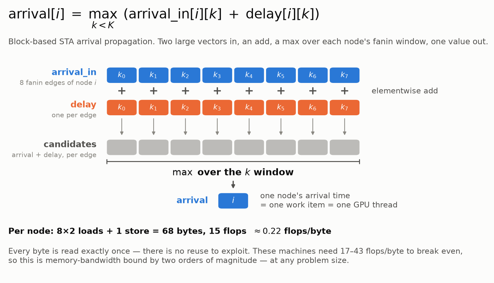
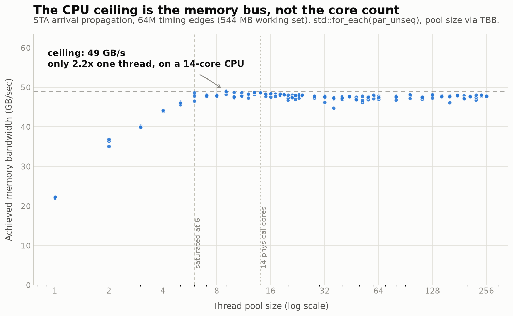
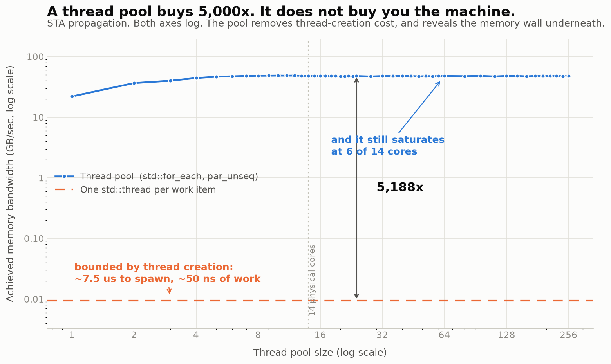
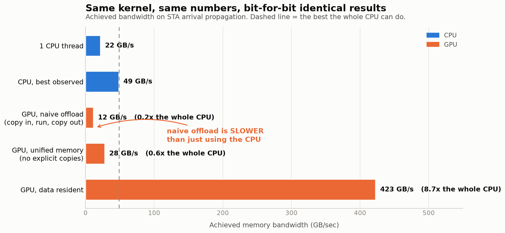
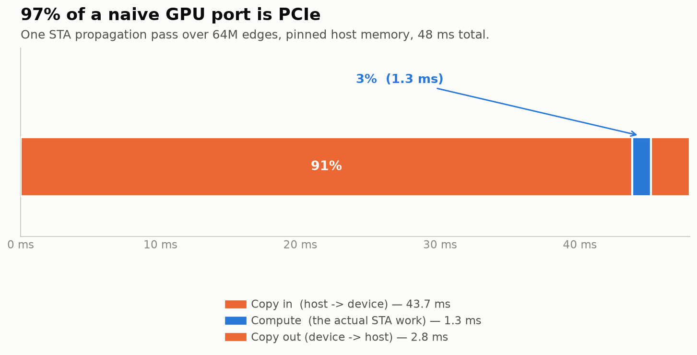
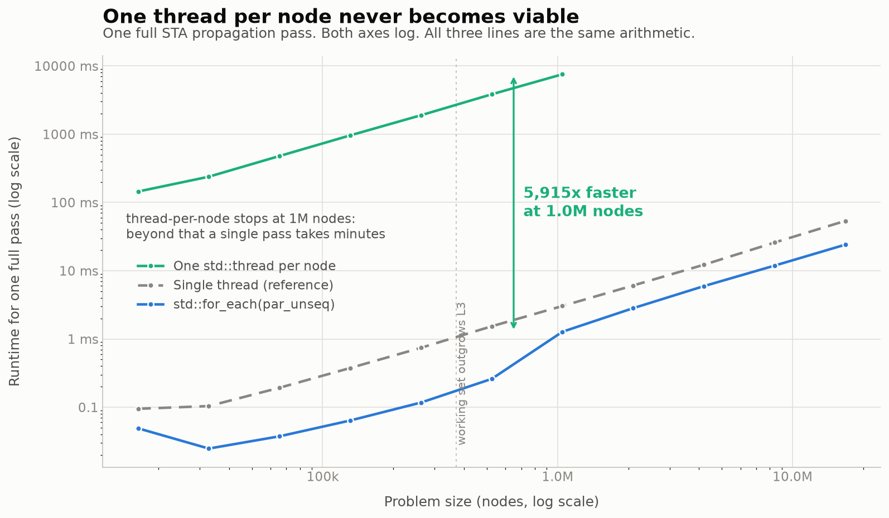
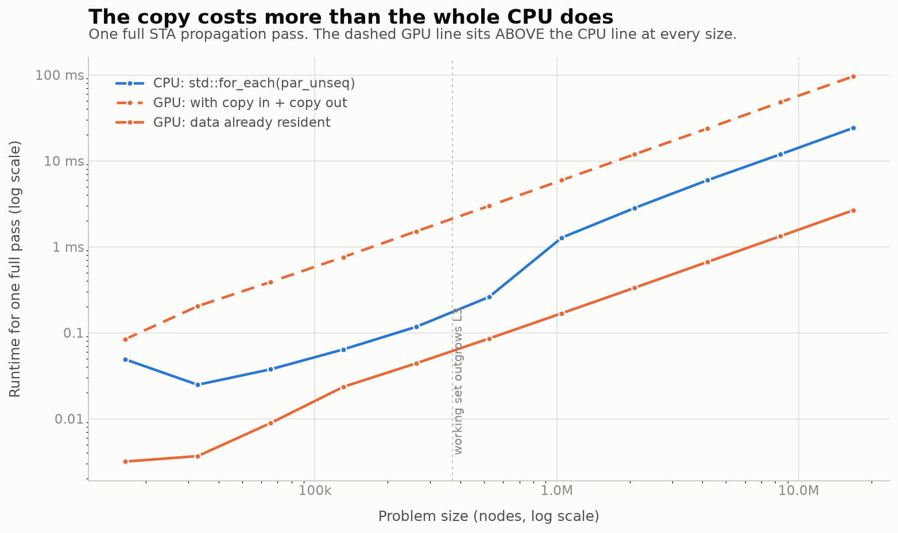

# Why GPU-accelerated STA — the opening experiment

A toy benchmark for the opening of a talk on GPU-accelerated static timing
analysis. It builds the case in three acts: one thread per work item, then a
thread pool, then the GPU — measuring at each step what is actually limiting
throughput. The figure layout is loosely modelled on the throughput-vs-threads
plots in Conor Spilsbury's CppCon 2025 *Threads vs. Coroutines*, but the kernel,
the workload and the conclusion are all different.

Talking points and anticipated audience questions: **[SPEAKER_NOTES.md](SPEAKER_NOTES.md)**.

## Status

**Built and measured** on i5-13500 + RTX A4000: the STA kernel (shared verbatim by
CPU and GPU), a CPU parallelism sweep, a GPU run with transfer breakdown, four
figures in light and dark, and speaker notes. All numbers below are reproducible
with `./run_all.sh && python3 plot.py`.

**The intended three-act narrative**, with measured numbers for each act:

| act | approach | result | what's actually limiting it |
|---|---|---:|---|
| 1 | one `std::thread` per work item | 0.009 GB/s | thread **creation** (~7.5 µs each vs ~50 ns of work) |
| 2 | thread pool / `std::for_each(par_unseq)` | 48.9 GB/s | **memory bandwidth** — saturates at 5–6 of 14 cores |
| 3 | GPU, data resident | 429.7 GB/s | bandwidth again, but 8.8× more of it |
| 3b | GPU, naive copy-in/copy-out | 11.9 GB/s | **PCIe** — 91% of the time is H2D |

Act 2's bottleneck is thread *creation*, **not context switching**. That was
measured, and the data is unambiguous: 512 compute-bound threads cause ~9,900
context switches/sec against a ~6,400/sec idle baseline, with throughput
unchanged. A blocking-I/O workload at 4096 threads causes 765,000/sec. Saying "the
pool fixes context switching" would not survive a question from the audience;
"the pool removes creation overhead and reveals the memory wall" does.

Act 1 will **not** reproduce the shape of the CppCon slides, and shouldn't: their
work item is a 10 ms blocking sleep, so their curve peaks and collapses. Ours is
50 ns of arithmetic, so it is a flat line rate-limited by the spawner.

**Open decisions**

- The roofline is built (`draw_roofline.py` → `figures/07_roofline.png`) and is a
  **backup slide**, not one of the main five. Left panel: intensity is
  (2K−1)/(8K+4), which tends to 1/4, so no fanin escapes the memory-bound regime.
  Right panel: the kernel's entire reachable intensity band against four
  rooflines (i5-13500, RTX A4000, A100 80GB, GH200), with the measured points
  sitting on the memory roofs. GPU figures are NVIDIA datasheet peaks, FP32
  non-tensor, checked August 2026. Note the ridge points: A4000 43, GH200 17,
  **A100 9.6** — datacentre parts are deliberately built with far more bandwidth
  per FLOP than workstation parts, so they move *toward* this kernel, not away
  from it.

## Porting to H100 and GH200

`make` uses `-arch=native`, so the build needs no change on either machine. Three
things do:

1. **Increase `--nodes`.** The kernel is 1.33 ms on an A4000 and would be ~0.2 ms
   on H100 — too short to time cleanly. 80 GB of HBM has room for a much larger
   graph. Scale until the kernel is at least a few ms.
2. **Reinstall TBB** (`conda install -c conda-forge tbb-devel`, `apt install
   libtbb-dev`, `dnf install tbb-devel`) and point the build at it if it is not on
   the default paths. `TBB_ROOT` is a **prefix** — the build looks for
   `$TBB_ROOT/include` and then `lib64` / `lib/<triplet>` / `lib` beneath it,
   because distributions disagree. `make tbb-info` prints what got resolved;
   `TBB_INC` and `TBB_LIB` override it directly.

   `bench_sta` now **aborts** if `std::execution::par` turns out to be running
   serially, rather than printing plausible but single-threaded numbers. Missing
   headers or library fail at build time anyway; the case this catches is a
   libstdc++ compiled without TBB support, where everything links and runs and is
   quietly wrong.
3. **Expect the CPU baseline to rise.** A server host with 8–12 memory channels
   does 200–400 GB/s, not this desktop's ~49, which narrows the GPU ratio. The
   *shape* of figures 1 and 2 holds regardless; only the ceiling moves.

### CUDA 13 and Grace (aarch64)

`cudaDeviceProp::clockRate` and `::memoryClockRate` were deprecated in CUDA 12 and
**removed in CUDA 13**, so unmodified source that compiles against 12.x fails on a
CUDA 13 toolkit. Both call sites now use `cudaDeviceGetAttribute`
(`cudaDevAttrClockRate`, `cudaDevAttrMemoryClockRate`,
`cudaDevAttrGlobalMemoryBusWidth`), which is valid on 11, 12 and 13 alike. Those
values are display-only, so they degrade to "not reported" instead of aborting.

Building with an older toolkit and running on a newer driver would also work — the
driver is backward compatible and nvcc links the runtime statically by default —
but it does not help here: Grace is aarch64, so you have to build on the GH200
regardless, and `-arch=native` on an x86 box would emit sm_86 rather than sm_90.
Keeping one source that builds on both machines is also one less confound when
comparing their numbers.

### The two machines tell different halves of the story

Running on both is worth doing, because they disagree about act 3 — and that
disagreement **is** the argument.

| | this box (PCIe) | GH200 (NVLink-C2C) |
|---|---:|---:|
| host→device link | 12.3 GB/s | **126.6 GB/s** |
| device→host link | 12.0 GB/s | **64.5 GB/s** |
| device memory peak | 448 GB/s | **4023 GB/s** |
| kernel, resident | 1.33 ms (430 GB/s, 96% of peak) | **0.20 ms (2852 GB/s, 71% of peak)** |
| copy in / copy out | 43.8 / 2.8 ms | **4.24 / 0.52 ms** |
| **transfer share of a naive port** | **97%** | **96%** |

Both columns are measured, not projected. The GH200 figures are 8.4M nodes
(537 MB in, 33.5 MB out, 570 MB touched per pass).

**The transfer share did not move.** The link got 10× faster and the kernel got
6.6× faster, so the ratio stayed where it was. This is the cleanest statement of
the thesis available: you cannot buy your way out of this with a faster
interconnect, because the interconnect and the compute scale together. An earlier
version of this file predicted ~88% for GH200 from the 450 GB/s C2C spec figure;
the measured single-stream rate is 126.6 GB/s, so the prediction was optimistic
and the real answer is starker.

Two smaller observations from the GH200 run, both worth a sentence if asked:

- **D2H runs at half the H2D rate** (64.5 vs 126.6 GB/s). Partly the smaller
  transfer (33.5 MB) not amortising ramp-up.
- **The kernel reaches 71% of peak bandwidth, against 96% on the A4000.** More
  headroom to chase on HBM3e, and not a criticism of the card — 2852 GB/s is
  still 6.6× the A4000's absolute throughput.
- **A single `cudaMemcpy` uses one copy engine.** 126.6 GB/s is roughly 28% of the
  450 GB/s per-direction C2C spec; saturating it generally needs several
  concurrent streams. Worth checking with NVIDIA's `nvbandwidth` before quoting
  126.6 as the machine's ceiling rather than this benchmark's.

### Unified memory got *worse* on GH200, and that is the interesting part

`gpu_managed` measures `cudaMallocManaged` with no explicit copies at all — the
"just let the hardware deal with it" path, which coherent NVLink-C2C is supposed
to make good.

| | this box (PCIe) | GH200 (C2C) |
|---|---:|---:|
| naive staged copies | 11.9 GB/s | 115 GB/s |
| **unified memory, no copies** | **42.6 GB/s** | **21.9 GB/s** |
| resident, no copies at all | 429.7 GB/s | 2852 GB/s |

On the PCIe box unified memory *beat* staged copies 3.6×, because the driver only
moves what is touched. On GH200 it is **5.3× slower than the staged copy** — 26 ms
against 4.96 ms — despite a link that is 10× faster and cache-coherent.

The likely cause is fault-driven migration rather than direct coherent access: the
benchmark's host-side read of the result each pass is enough to start pages moving
back and forth. A real implementation would pin the placement with
`cudaMemAdvise(cudaMemAdviseSetPreferredLocation / SetReadMostly)` and
`cudaMemPrefetchAsync`. **This benchmark does not yet do that, so treat 21.9 GB/s
as the cost of naive unified memory, not as what GH200 can do.**

Which is arguably the better slide anyway: the hardware made the link ten times
faster and coherent, and the naive code got *slower*. The problem was never the
link. It is that somebody has to decide where the data lives.

## The kernel

Block-based STA propagates arrival times forward through the timing graph:



One work item is one node: take each of its fanin edges, add the edge delay to
the arrival time coming in, keep the max. That is what a single `std::thread`
does in act 1, and what a single GPU thread does in act 3 — the same function,
`sta::propagate`, compiled by both toolchains.

Two large vectors, an elementwise add, a max-reduction over each node's fanin
window. 8M nodes × 8 fanin = **64M timing edges, 544 MB working set** — 22× this
machine's L3, so nothing is hiding in cache.

Per node it moves 68 bytes and does 15 flops: **0.22 flops/byte**. Machine balance
(peak FLOP/s ÷ peak bytes/s) is 28 on this CPU, 43 on the A4000 and 17 on an
H100 — so the kernel sits two orders of magnitude inside the memory-bound regime,
and no problem size changes that, because every byte is read exactly once and
there is no reuse to exploit. This kernel is bound by memory bandwidth, not
arithmetic. That is the honest STA regime, and it
is why every result below tracks bandwidth ratios rather than FLOP ratios.

## Results on this machine

i5-13500 (6 P + 8 E = 14 physical / 20 logical) · RTX A4000 (48 SM, 448 GB/s) ·
CUDA 12.6 · gcc 13.3 · TBB 2022

| | achieved GB/s | vs. best CPU |
|---|---:|---:|
| one `std::thread` per work item | 0.009 | 0.0002× |
| 1 CPU thread | 22.2 | 0.46× |
| CPU, saturated plateau (6+ threads) | ~47–48 | 0.97× |
| **CPU, best observed** | **48.9** | **1.0×** |
| GPU, naive offload (copy in, run, copy out) | 11.9 | **0.24×** |
| GPU, unified memory (no explicit copies) | 42.6 | 0.87× |
| GPU, data resident | 429.7 | **8.8×** |

Three findings, in the order the figures present them:

- **The CPU ceiling is the memory bus.** Throughput saturates at **5–6 threads**.
  Fourteen physical cores buy **2.2×** over one thread. Cores 7–14 contribute
  nothing — they are queued on the same memory controller. (Don't quote a "best at
  N threads": above the knee the curve is flat and its argmax wanders between ~9
  and ~24 run to run. Quote the plateau.)
- **The GPU wins by exactly the bandwidth ratio.** 429.7 GB/s is 96% of the card's
  448 GB/s peak; 429.7 / 48.9 = 8.8×. Not a coincidence, and not a FLOP story.
- **A naive port is 4× slower than the CPU.** Copy-in/run/copy-out achieves
  11.9 GB/s, well below the CPU's 48.9. The breakdown says why:

| phase | ms | share |
|---|---:|---:|
| copy in (H2D) | 43.8 | **91%** |
| **compute** | **1.3** | **3%** |
| copy out (D2H) | 2.8 | 6% |

Host staging is **pinned** memory, so that is PCIe's best case (12.3 GB/s measured).
The conclusion is robust to a faster link: at full PCIe 4.0 (~25 GB/s) transfer
would still be ~94% of the time.

CPU and GPU produce **bit-identical results** (checksum `9386759311749429`) —
`-ffp-contract=off` on the host, `--fmad=false` on the device.

### Where each number comes from

Three provenances, and it is worth keeping them apart when defending the work.

**Measured by this repo** — reproducible via `./run_all.sh`, raw data in `data/*.csv`:

| number | source |
|---|---|
| i5-13500 48.9 GB/s, saturation at 5–6 threads, 2.2× | `data/sta_cpu.csv` |
| thread-per-node 0.0094 GB/s, the 5,188× gap | `data/sta_cpu.csv` |
| A4000 429.7 GB/s resident, 11.9 staged, 42.6 managed | `data/gpu_sta.csv` |
| transfer breakdown 43.8 / 1.33 / 2.8 ms → 97% | `data/gpu_breakdown.csv` |
| runtime vs problem size | `data/size_*.csv` |
| GH200 2852 GB/s, 126.6 GB/s link, 96% transfer share | measured on the GH200 |
| CPU/GPU checksum equality | printed by both binaries |

**Vendor specifications** — the roofline *lines* only. NVIDIA datasheet figures
(FP32 non-tensor), verified August 2026:

| | FP32 | bandwidth |
|---|---:|---:|
| RTX A4000 | 19.2 TF | 448 GB/s |
| A100 80GB | 19.5 TF | 2039 GB/s |
| GH200 (H100, 96 GB HBM3) | 67 TF | 4000 GB/s |

**Estimated** — flagged on the figure itself:

- The i5-13500's ~1.37 TFLOPS peak FP32. Intel does not publish a peak-FLOPS
  figure for consumer parts; this is cores × clock × AVX2 FMA width, so treat it
  as ±30%. It only positions the CPU's ridge point, and the kernel sits ~100×
  away from it, so nothing depends on the precision.
- The CPU's memory roof uses this repo's *measured* streaming rate rather than a
  DIMM spec (unreadable without root), which is why the CPU's measured point sits
  on its own roof by construction.

**Note on the A100 line:** nothing here was run on an A100. That roofline is
vendor spec only — which is why it carries no measured diamond. It is there to
show the ridge-point trend across generations (A4000 43 → GH200 17 → A100 9.6),
not to claim a result.

### The `std::execution::par` trap

libstdc++ implements C++17 parallel algorithms on Intel TBB. **Without TBB linked,
`par` and `par_unseq` silently run sequentially** — no warning, no error, no link
failure. Measured here before and after installing it:

```
                    without TBB        with TBB
execution::seq      3.05 s / 1 thread  3.05 s / 1 thread
execution::par      3.02 s / 1 thread  0.18 s / 20 threads
```

`make tbb-check` reports which one you have. Install without sudo:
`conda install -c conda-forge tbb-devel`.

### Honest caveats

- **Fanin is fixed at 8 and bucketed by degree.** Real timing graphs are irregular.
  That irregularity hurts the CPU *more* (gather, pointer chasing, branch misses),
  so this is the charitable case for the CPU. `--layout aos` shows what a
  less-friendly layout costs both sides.
- **A many-channel server CPU narrows the gap a lot.** A 12-channel Genoa does
  ~400 GB/s and lands near this GPU. The *shape* of figure 1 holds on any machine;
  only the height of the ceiling moves.
- **This is full re-propagation, not incremental STA.** Incremental work is smaller
  and latency-bound, which makes the per-unit transfer cost worse, not better.
- For contrast, the same GPU gives **72×** on a compute-bound Mandelbrot kernel
  (`make ref`). The difference between 72× and 8.8× is arithmetic intensity —
  worth knowing, even if it doesn't make the slide deck.

## Figures

Every figure below regenerates from `data/*.csv`. Dark versions live in
`figures/dark/`.

### 1. The CPU ceiling is the memory bus, not the core count



Throughput saturates at 5–6 threads. The other eight cores are queued on the same
memory controller.

### 2. A thread pool buys 5,000×, and still can't use half the CPU



Act 1 against act 2, with the GPU's bandwidth on the same axis for scale. Deleting
the obvious overhead — thread creation — bought four decades, and the wall
underneath did not move. There is still 8.8× above it that no amount of CPU
threading reaches.

### 3. Same kernel, same numbers, bit-for-bit identical results



The GPU is 8.8× the whole CPU with data resident. Copy in and out per call and it
is 4× *slower* than the CPU. Unified memory recovers most of that and still lands
below the CPU, because every page it touches still crosses PCIe.

### 4. 97% of a naive GPU port is PCIe



The timing analysis itself is 3% of the wall clock.

### 5. One thread per node never becomes viable



Runtime against problem size for the three CPU strategies. The thread-per-node
line is measured up to 1M nodes; beyond that a single pass takes minutes. All
three lines compute exactly the same arithmetic.

The speedup arrow is anchored at the **largest** problem size on purpose. The raw
maximum ratio is higher (16,180× at 16k nodes), but that is an artefact of the
pool's working set fitting in cache at small sizes — quoting it would overstate
the result.

### 6. The copy costs more than the whole CPU does



The dashed GPU line sits above the CPU line at *every* problem size. The gap
between the two GPU lines is the copy, and it never closes — it is proportional
to the data, exactly like the work is. Arrows anchored at the largest size for the
same reason as figure 5 (the ratio peaks at small sizes where CPU dispatch
overhead dominates, which would overstate it).

## Running it

```sh
./run_all.sh            # ~15 min: builds, sweeps, writes data/*.csv
python3 plot.py         # figures 01-06
python3 draw_problem.py  # the problem-formulation diagram
python3 draw_roofline.py # the roofline backup slide
```

`run_all.sh` sets `ulimit -s 1024` — the blocking-I/O contrast sweep holds 4096
live threads and glibc sizes thread stacks from `RLIMIT_STACK`.

Needs `nvcc`, TBB (see above), and Python with matplotlib. `make sta` builds only
the STA benchmarks; `make ref` builds the Mandelbrot reference.

## Layout

```
src/sta.hpp             the STA kernel, compiled by BOTH g++ and nvcc
src/bench_sta.cpp       CPU: std::for_each(par_unseq), pool size via TBB
src/bench_sta_gpu.cu    GPU: kernel, naive offload, transfer breakdown
src/workload.hpp        compute-bound Mandelbrot reference (roofline contrast)
src/bench_threads.cpp   throughput vs thread count (--mode io | cpu)
src/bench_gpu.cu        Mandelbrot on the GPU
plot.py                 CSVs -> figures 01-06
draw_problem.py         the problem-formulation diagram (00)
draw_roofline.py        the roofline backup slide (07)
```

There is no hand-written thread pool: the CPU benchmark uses `std::for_each` with
`std::execution::par_unseq`, and sweeps pool size with
`tbb::global_control(max_allowed_parallelism, K)`. With the standard parallel
algorithms, "thread count" and "pool size" are the same knob.
